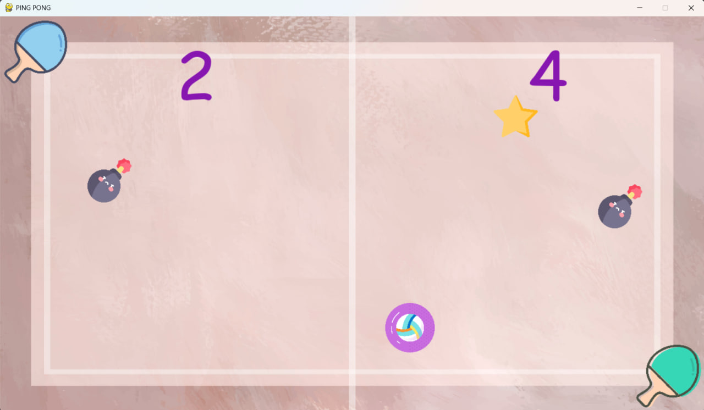

# PingPong

## Описание проекта
**Ping-Pong** — это мой учебный игровой проект, разработанный в рамках дисциплины «Основы разработки программного обеспечения». Это переосмысленная классическая игра Pong для двух игроков с акцентом на эстетику и дополнительные игровые объекты — бомбы и звёзды.​

Игровое поле оформлено в мягких пастельных тонах, с минималистичным дизайном и аккуратными анимациями, что делает процесс не только динамичным, но и визуально комфортным.​

## Игровой процесс
В игре участвуют два игрока, каждый управляет своей ракеткой и старается отбивать мяч, не давая ему вылететь за край поля. На поле в случайные моменты появляются бомбы и звёзды, которые влияют на подсчёт очков и добавляют элемент стратегии.​

Если после удара первого игрока мяч сталкивается с бомбой, очко засчитывается второму игроку; если мяч попадает в звезду — очко получает первый игрок. Аналогичная логика может применяться и к ударам второго игрока, что создаёт неожиданные развороты в матче.

## Особенности и преимущества
- Учебный проект по ОРПО: Игра демонстрирует базовые принципы разработки ПО, работу с Pygame и организацию кода в небольшом игровом приложении.​

- Два живых игрока (PvP): Игра рассчитана на режим «игрок против игрока», где результат зависит только от реакции и координации игроков.​

- Бонусы и ловушки: Бомбы и звёзды меняют подсчёт очков и заставляют игроков продумывать траектории удара, а не просто «отбивать всё подряд».

- Пастельная эстетика: Ненавязчивые цвета и минималистичная стилизация создают приятное визуальное окружение.​

- Простая установка: Для запуска достаточно Python и библиотеки Pygame, без сложных внешних зависимостей.​

## Управление
Управление в игре интуитивно и отлично подходит для игры вдвоём за одной клавиатурой.​

- Игрок 1 (правая ракетка): стрелка вверх (↑) — движение вверх, стрелка вниз (↓) — движение вниз.

- Игрок 2 (левая ракетка): клавиша W — движение вверх, клавиша S — движение вниз.

## Установка и запуск

1. Склонировать репозиторий https://github.com/ritabokach/PingPong.git
2. Установить Pygame: `pip install pygame`
3. Запустить игру: `python main.py`
